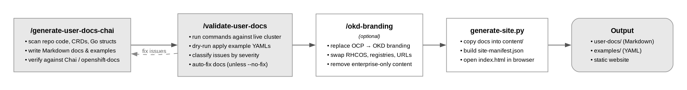

# operator-user-docs

A Claude Code plugin that generates, validates, and brands user-facing documentation for OpenShift operators, directly from source code.

## Example Generated User Docs

<https://jatinsu.github.io/operator-user-docs/>

## Quickstart

### 1. Load the plugin

**Option A:** Install permanently

```bash
claude plugin add jsuri/operator-user-docs
```

**Option B:** Load from a local directory for the current session only

```bash
claude --plugin-dir /path/to/operator-user-docs
```

### 2. Generate docs for an operator

```
/generate-user-docs-chai /path/to/your-operator
```

### 3. Validate against a live cluster

```
/validate-user-docs /path/to/your/kuebconfig /path/to/your-user-docs
```

### 4. (Optional) Convert to OKD branding

```
/okd-branding /path/to/your/user-docs/
```

### 5. Build a browsable website

```bash
cd create-docs-website
python3 generate-site.py /path/to/your/user-docs
# Open index.html in a browser
```

## Workflow


